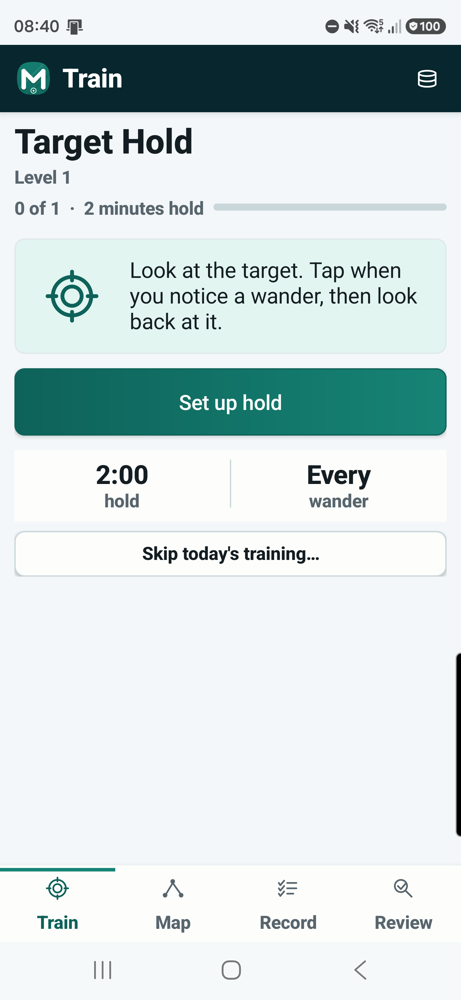
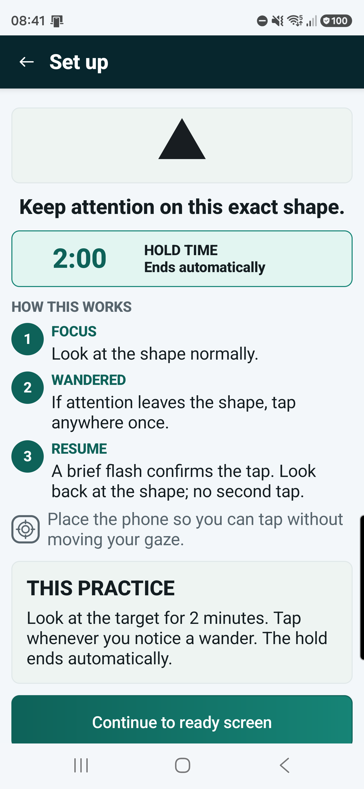
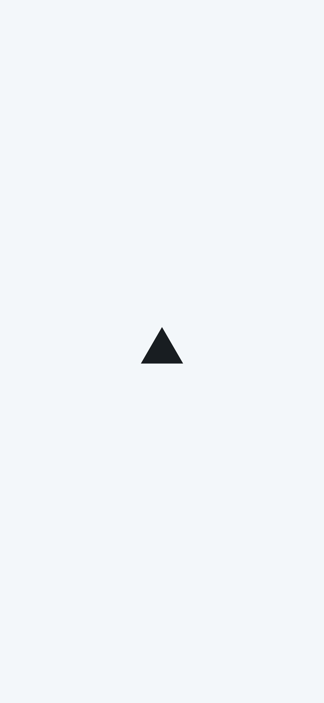
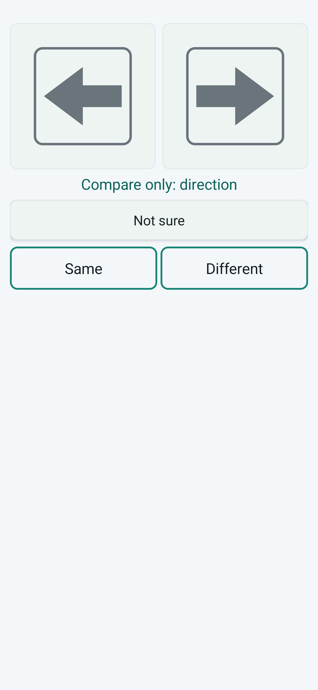

# Mental Gymnastics

Mental Gymnastics is a native, offline Android training product for standards-based mental practice. It prescribes one counted session per local program day, changes one named load variable at a time from recorded evidence, executes all 40 documented branch-level standards, and lets the Core library decide progression without relying on streaks or self-certified advancement.

The implementation is split into pure domain rules, local persistence, deterministic generated content, a headless runtime, app workflows, and a native Android UI. The app has no accounts, network dependency, telemetry, cloud sync, or AI/API dependency.

## Android Experience

The interface follows an explicit attention budget: setup explains the task, live practice shows only the stimulus and immediate action, and measurement returns after the cognitive work. Visual drills render the objects themselves rather than asking the practitioner to memorize descriptor text or internal content data.

<table>
  <tr>
    <td align="center" width="25%">
      <br />
      <sub>Today’s prescribed work</sub>
    </td>
    <td align="center" width="25%">
      <br />
      <sub>Setup before cognitive load</sub>
    </td>
    <td align="center" width="25%">
      <br />
      <sub>Distraction-free Focus Hold</sub>
    </td>
    <td align="center" width="25%">
      <br />
      <sub>Objects, not descriptors</sub>
    </td>
  </tr>
</table>

## A Discipline, Not An Atmosphere

Mental Gymnastics occupies some of the same territory as meditation and contemplative practice: attention, awareness of drift, deliberate return, restraint under impulse, and stability under pressure. Its disagreement is not with inner practice itself. It is with practices that remain too vague to distinguish transformation from participation.

The product can be understood as:

> Meditation with progressive overload, observable standards, and transfer tests.

Focus Hold makes the distinction concrete. Look at one visible target, mark every noticed wander, look back at it, and meet a defined duration standard. The rest of the curriculum extends that discipline into switching, working memory, inhibition, discrimination, conceptual operations, pressure recovery, and integrated performance.

| Common contemplative framing | Mental Gymnastics |
| --- | --- |
| Observe your mind | Record an observable event |
| Deepen awareness | Meet a defined standard |
| Trust the process | Test transfer |
| Treat every session as meaningful | Classify the actual result |
| Repeat indefinitely | Progress, stabilize, own, and maintain |
| Let a teacher, tradition, or feeling validate progress | Let evidence gate progress |

The intended outcome is not a mystical state or a flattering score. It is greater deliberate control of attention, thought, and action: noticing loss of form earlier, returning deliberately, resisting task substitution, marking uncertainty, and preserving standards under pressure.

Mental Gymnastics does not claim enlightenment, clinical treatment, or guaranteed general-intelligence gains. It provides a falsifiable practice architecture for capacities that are otherwise easy to romanticize and difficult to verify.

## Program Shape

- One locally prescribed daily experience, with recovery and off days treated as part of programming.
- Eight branches and 40 branch-level standards, from protected foundational work through transfer and global review.
- A verified perfect-practice path of 727 calendar days, including 624 active days and 1,230 drill blocks.
- An average active-day dose of about 15.4 minutes; failed standards repeat or regress instead of granting cosmetic progress.
- A finite curriculum milestone followed by maintenance, retesting, decay, and restoration rules.

## Architecture

| Layer | Project | Responsibility |
| --- | --- | --- |
| Core | `src/MentalGymnastics.Core` | The 40 executable standards, branch-level state machine, gates, progressive load, daily programming, readiness, ownership, stabilization, maintenance, decay, dependency caps, balance, transfer, recovery, deload, failure routing, and global review rules. |
| Persistence | `src/MentalGymnastics.Persistence` | Offline, userless, app-owned local JSON storage for daily prescriptions, practitioner state, sessions, attempts, evidence, stabilization, maintenance, decay/restoration, generated instances, active runtime snapshots, progress summaries, backup/restore, migrations, transactions, and integrity validation. |
| Runtime | `src/MentalGymnastics.Runtime` | Headless live session execution: definitions, lifecycle, UTC-comparable clocks, phases, cues, drill commands, objective scoring facts, evidence capture, completion results, snapshot/restore, and Core/Persistence handoffs. |
| Generated Content | `src/MentalGymnastics.Content` | Local deterministic drill material, content identity/versioning, freshness/equivalence, local content banks, validation, difficulty audit, runtime packaging, and persistence handoff. |
| App Integration | `src/MentalGymnastics.App` | Workflows that compose Core, Persistence, Runtime, and Generated Content for daily selection, pressure/recovery priority, content and runtime preparation, completion processing, active snapshots, global review, and progress refresh. |
| Android | `src/MentalGymnastics.Android` | Native Train, Map, Record, Review, live drill, result, evidence, and local backup/restore surfaces. It renders App/Runtime state and owns no progression or persistence rules. |

Dependency direction should stay one-way: lower libraries do not reference `MentalGymnastics.App` or Android. Android may reference the pre-UI app integration layer.

## Persistence

Persistence is intentionally local JSON right now. SQLite, Room, SharedPreferences progression mirrors, accounts, sync, backend services, telemetry, analytics, notifications, and AI/API dependencies are not required for the current architecture.

Use `LocalDatabaseOptions.ForAppOwnedPath(...)` and the persistence stores through app integration. If a future workflow needs new stored facts, add them to `MentalGymnastics.Persistence` with tests rather than creating a parallel Android-local store.

## Android Contract

The Android UI:

1. Supply an app-owned local JSON file path to `AppStartupConfiguration`.
2. Uses `PreUiTrainingWorkflowService`, `DailyTrainingWorkflowService`, and related app-layer services for startup, daily work, content preparation, runtime sessions, safe snapshot handling, completion, review, and progress refresh.
3. Render app-facing read models and runtime state.
4. Forward user actions into runtime/app integration commands.
5. Display Core decisions as returned without weakening prerequisites, standards, maintenance blocks, dependency caps, or failed/abandoned session outcomes.

Android does not create independent phase timers, cue schedulers, hidden evidence logs, screen-local pass/fail flags, SharedPreferences or Room progression state, ad hoc prompts, generated-content identity schemes, or direct advancement decisions.

## Documentation

Start with [docs/README.md](docs/README.md). The key references are:

- [Progression Against Vibes](docs/foundation/progression-against-vibes.md)
- [Standards-Based Skill Ladder](docs/foundation/standards-based-skill-ladder.md)
- [Complete Training Program](docs/program/training-program.md)
- [Core Library](docs/core-library.md)
- [Local Persistence Boundary](docs/local-persistence-boundary.md)
- [Session Runtime Boundary](docs/session-runtime-boundary.md)
- [Generated Content Boundary](docs/generated-content-boundary.md)
- [Pre-UI App Integration Boundary](docs/app-integration-boundary.md)
- [Android UI Layer](docs/android-ui-layer.md)

## Requirements

- .NET SDK 10.0.301 or newer compatible 10.0 SDK
- .NET Android workload for building/deploying the Android host
- Android SDK platform tools (`adb`) for device deployment
- A phone with Developer options and USB debugging enabled for deployment

## Build And Test

```powershell
dotnet build .\MentalGymnastics.sln -c Debug
dotnet test .\MentalGymnastics.sln --no-build
dotnet build .\src\MentalGymnastics.Android\MentalGymnastics.Android.csproj -c Release
```

## Try It On Your Android Phone

The simplest installation path is to let a local coding agent build and deploy the repository.

1. On the phone, open **Settings > About phone** and tap **Build number** seven times to enable Developer options. The exact menu name varies by manufacturer.
2. Open **Developer options** and enable **USB debugging**.
3. Connect the phone to the computer with a data-capable USB cable.
4. Unlock the phone and accept the **Allow USB debugging** RSA prompt. Enable "Always allow from this computer" if this is your own machine.
5. Open this repository in a coding agent that can run local terminal commands.
6. Ask it:

> Build the Android Release app from this repository, install it on my USB-connected physical phone, launch it, and add it to my home screen. Do not modify or clear data on any other connected device.

The agent should read `AGENTS.md`, verify the physical device with `adb devices -l`, build the Android project, install the signed APK to that specific device, launch `com.nopara73.mentalgymnastics`, and use the phone's launcher to place the icon on the home screen.

### Manual Fallback

Verify that the phone is authorized:

```powershell
adb devices -l
```

Build, install, and launch the app:

```powershell
.\eng\deploy-android.ps1
```

The app package ID is `com.nopara73.mentalgymnastics`.
