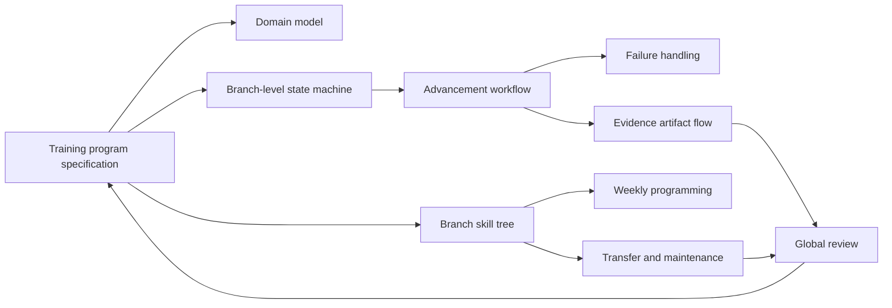

# MentalGymnastics Diagrams

These diagrams codify the structure of the training program in [docs/program/training-program.md](../program/training-program.md). They are documentation artifacts only. They do not define app behavior, UI behavior, validation scripts, or automated checks.

The diagrams emphasize earned advancement: load, constraints, standards, evidence, stabilization, transfer, maintenance, decay, and global review. Participation, effort, or insight alone never advances a practitioner.

## Inline Overview

## Diagram Index

| Diagram | Source | What it clarifies |
| --- | --- | --- |
| Domain model / UML class diagram | [domain-model.mmd](domain-model.mmd) | Core program entities and how standards, gates, test attempts, evidence, maintenance, transfer, and review relate to branches and levels. |
| Branch dependency / skill tree | [branch-skill-tree.mmd](branch-skill-tree.mmd) | Foundational and advanced branch prerequisites, unlock rules, global balance caps, and decay blocks. |
| Branch-level state machine | [branch-level-state-machine.mmd](branch-level-state-machine.mmd) | Lifecycle of a branch-level pair from unopened through ownership, maintenance, decay, restoration, and next-level unlock. |
| Advancement workflow | [advancement-workflow.mmd](advancement-workflow.mmd) | The required path from training to test readiness, formal testing, stabilization, ownership, and next-level unlock. |
| Failure handling | [failure-handling.mmd](failure-handling.mmd) | How technical failure, effort failure, overload, and bad programming route to different programming responses. |
| Weekly programming overview | [weekly-programming.mmd](weekly-programming.mmd) | Beginner, intermediate, and advanced weekly structures at a high level. |
| Transfer and maintenance | [transfer-maintenance.mmd](transfer-maintenance.mmd) | How owned levels enter maintenance, how transfer tests preserve source standards, and how decay blocks dependent advancement. |
| Evidence artifact flow | [evidence-artifact-flow.mmd](evidence-artifact-flow.mmd) | Where artifacts are created and which artifacts are lightweight versus formal enough to support gates and reviews. |
| Global review | [global-review.mmd](global-review.mmd) | Whole-practitioner review inputs, pass conditions, decisions, and programming outputs. |

## Format

All diagram source files are Mermaid (`.mmd`). Mermaid was chosen because GitHub and many Markdown tools can render it directly.

No rendered SVG or PNG files are included. The local Mermaid CLI (`mmdc`) and PlantUML command were not available, and no new rendering tools were installed.

`npx --no-install @mermaid-js/mermaid-cli --version` was also checked and reported that the Mermaid CLI package was not locally available.

## Viewing

Open any `.mmd` file in a Mermaid-aware Markdown editor or renderer. The source files are intentionally kept close to the program terminology so they can be reviewed and refined alongside the training document.
